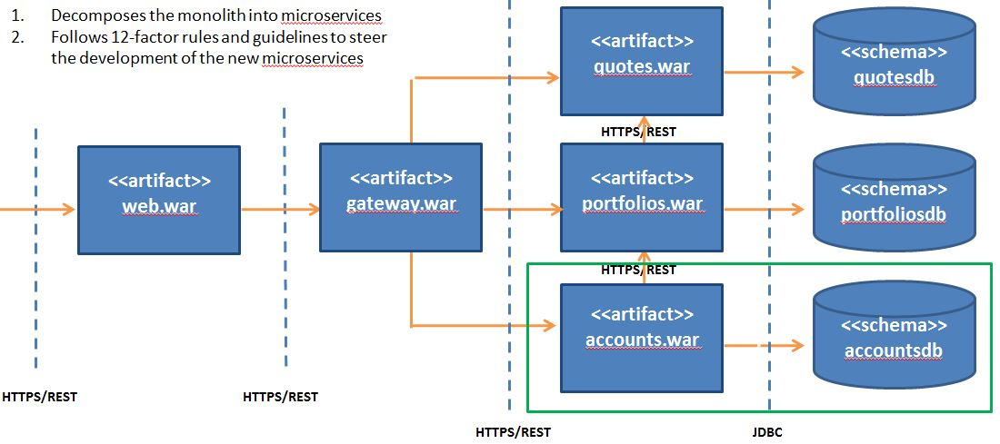

# Accounts Microservice

	The APIs to the accounts business functions

## Current State Architecture

DayTrader is multi-tier application built around the paradigm of an online stock trading system. Example business functions include
login, register, view portfolio, lookup stock quotes, and buy or sell stock. DayTrader was originally developed by IBM and donated 
to the Apache Geronimo community in the 2005 timeframe. The DayTrader architecture is representitive of monolithic applications that 
many businesses are still using. For that reason, we selected it to clarify the techniques for refactoring a monolith to microservices. 
For the original monolithic architecture, see http://geronimo.apache.org/GMOxDOC30/daytrader-a-more-complex-application.html. 

## Target State Architecture

### Accounts Application

The Accounts Application(highlighted in the green box) is a Spring Boot Application responsible for managing user accounts

#### Static Viewpoint

#### Dynamic Viewpoint

#### Participant and Responsibilities

### Accounts Database

The Accounts Database(highlighted in the green box) stores user account information. 

Note: attributes not directly related to accounts are struck through in the diagram.

## Prerequisites

		1.	Java Development Kit (64 bit) 1.8+
		2.	Apache Maven 3.3.9+

## Delivery Pipeline

### Build Automation

		1.	cd daytrader-accountsapp
		2.	mvn clean install

### Continuous Integration

		1.	cd daytrader-accountsapp
		2.	mvn -Pci clean install

## API Endpoints 

### Swagger UI Documentation

	To see the API documentation, 

		1. Start the application

			a.	cd daytrader-accountsapp
			b. 	daytrader-accounts\env\external\bin\start_server

		2. 	Point you browser to https://localhost:1443/swagger-ui.html

		3.	Stop the application after reviewing the API documentation

			a.	cd daytrader-accountsapp	
			b.	daytrader-accounts\env\external\bin\stop_server

		